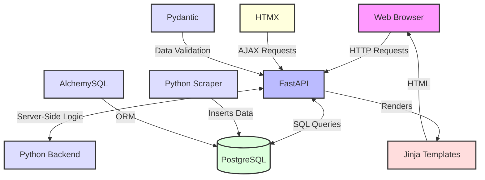

# Semiscraper - Web Scraper Project

## Overview

This project implements a modular web scraping framework designed to extract product information from multiple e-commerce websites. It utilizes Python and various libraries to fetch web pages, parse HTML content, and save the extracted data to CSV files.

# Technology Stack



## Features

- Modular design allowing easy addition of new scrapers
- Configurable pagination support
- User-agent rotation and request delays to avoid detection
- Error handling and logging
- Data export to CSV format

## Dependencies

- Python 3.x
- requests
- pandas
- python-dotenv
- BeautifulSoup4 (assumed, for HTML parsing in specific scraper modules)

## Project Structure

- `main.py`: Core scraping logic and utility functions
- `urltwo_scraper.py`: Scraper module for the first target website
- `urlthree_scraper.py`: Scraper module for the second target website
- `.env`: Environment file for storing configuration variables

## Usage

1. Set up the environment variables in `.env`:
   ```
   urltwo=<base_url_for_first_site>
   urltwo_pagination_suffix=<pagination_pattern_for_first_site>
   urlthree=<base_url_for_second_site>
   urlthree_pagination_suffix=<pagination_pattern_for_second_site>
   ```

2. Run the main script:
   ```
   python main.py
   ```

## Key Functions

- `load_config()`: Loads configuration from environment variables
- `create_session()`: Sets up a requests session with custom headers
- `fetch_page()`: Retrieves HTML content from a given URL
- `scrape_all_pages()`: Orchestrates the scraping process across multiple pages
- `save_to_csv()`: Exports scraped data to a CSV file

## Extending the Project

To add a new scraper:
1. Create a new module (e.g., `new_site_scraper.py`) with a `scrape_page()` function
2. Import the new module in `main.py`
3. Add appropriate environment variables
4. Call the `main()` function with the new scraper module and config keys

## Note

This scraper is designed for educational purposes. Ensure compliance with the target website's robots.txt and terms of service before deployment.
